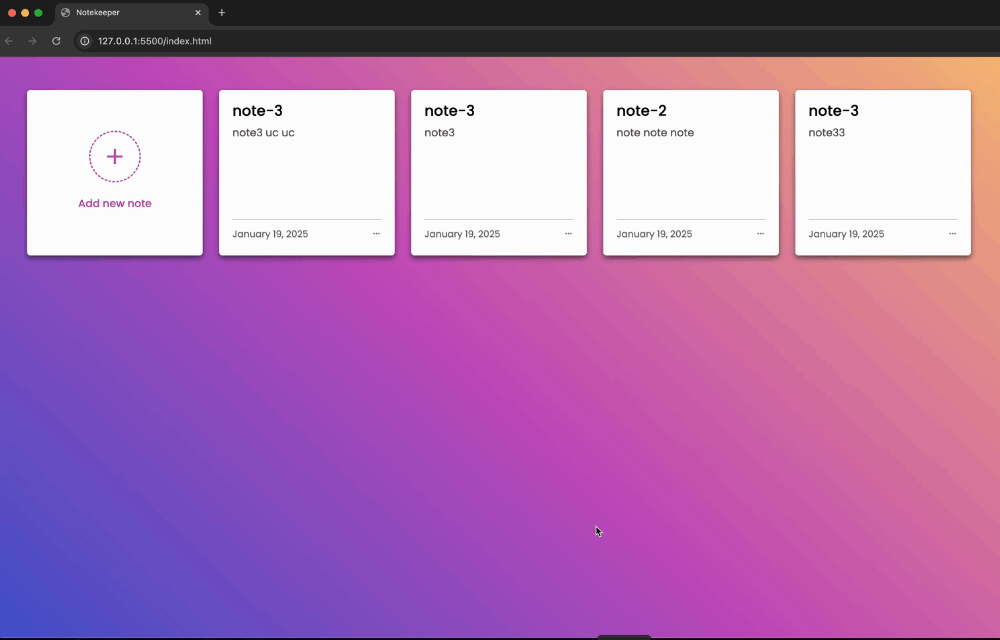

# NOTE -KEEPER

<h1> ✨ Welcome to Your Personal Note-Taking App! ✨</h1>

<h3>This app allows you to effortlessly write, delete, and edit your notes anytime you want! 📝</h3>

<h3>Whether it's a brilliant idea 💡, a task to do 🗂️, or a reminder for later ⏰, you have full control over your notes!</h3>

<h2>Features:</h2>

<h3>✍️ Write Notes: Capture your thoughts, tasks, or reminders with ease.</h3>

<h3>🗑️ Delete Notes: Don't need something? Simply remove it with a click.</h3>

<h3>🔄 Edit Notes: Need to change or update your note? Go ahead and edit it anytime! <h3>

<h3>Stay organized and let your ideas flow smoothly! 🌟</h3>

<h2>✨ Powered by HTML, CSS, and JavaScript! ✨</h2>

<h3>This note-taking app is built using HTML, CSS, and JavaScript, the essential trio for creating modern, interactive websites! 🌐</h3>

<h3>HTML (HyperText Markup Language): The backbone of the website! It provides the structure, organizing all the elements like buttons, input fields, and notes themselves. 📄</h3>

<h3>CSS (Cascading Style Sheets): Gives the website its beautiful and stylish appearance! 🎨 It makes sure everything looks neat, responsive, and aligned, from fonts to colors, and even animations! ✨ </h3>

<h3> JavaScript: The magic behind the functionality! 💻 It allows you to write, edit, and delete notes, making the app dynamic and interactive. Every action you take is smoothly handled with JavaScript’s power. ⚡</h3>

